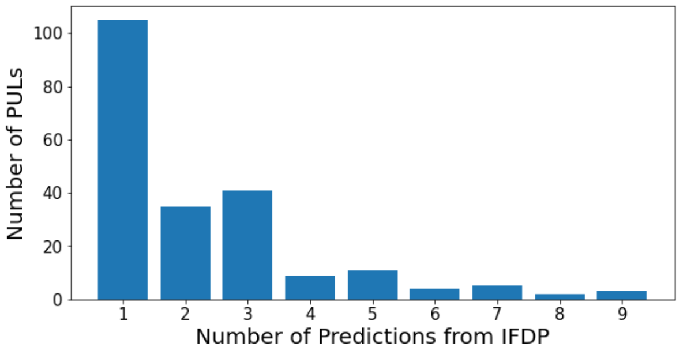

```{r setup, include=FALSE}
knitr::opts_chunk$set(echo = TRUE)
```

# Summary of Findings

1. IFDP method is using different naming conventions for their `high_level_substrates`. $72\%$ (18) of the `high_level_substrates` from the experimentally verified PUL `high_level_substrates` share the same naming convention with IFDP (after lower casing).  For the rest of the `high_level_substrates` that do not appear in the IFDP predictions, we would need a mapping so we can map the `high_level_substrates` from the experimentally verified PUL data to IFDP `high_level_substrates`. 

2. If we just analyze the PULs corresponding to the $72\%$ (18) `high_level_substrates` that share the same name we cover almost $52.31\%$ (215) of the PULs that we have in the experimentally verified PUL data (411). 

3. IFDP method predicts the relative abundance of the high level substrates in the PULs and this relative abundance is like a score. We can consider this as the probability score that is outputted from the subFinder pipeline. Just as we take the `high_level_substrates` corresponding to the maximum probability as the predicted substrate from subFinder, we can consider the `high_level_substrates` with maximum relative abundance from IFDP as the predicted `high_level_substrates` for that PUL.

4. However, their method has a lot of ties and a definitive prediction of the `high_level_substrates` for a PUL is next to impossible for majority of the PULs. The bar plot below shows the number of PULs corresponding to the number of `high_level_substrates` predicted from IFDP method. For example, for only 105 out of the 215 PULs from (2) have a single definitive prediction for the high level substrate which amounts to an abysmally low $48.83\%$. The IFDP method for some PULs gives 9 predicted `high_level_substrates`. 



5. First, IFDP due to the nature of giving multiple `high_level_substrates` predictions, we cannot make a definite prediction for $51.16\%$ (110) of the PULs from (2). For the rest $48.83\%$ (105) of the PULs on which there is a single definitive prediction of the `high_level_substrates` from IFDP, their prediction matches the ground truth experimentally verified `high_level_substrates` a meager $58.09\%$. 

# Conclusion from Findings

1. IFDP method is very naive and there is no machine learning sophistication to it. It is purely a descriptive method based on counting. 

2. IFDP can confuse the practitioners as for majority of the PULs it cannot give a single definite prediction for the `high_level_substrates`. This would introduce the additional burden on the practitioners to decide for themselves the most likely prediction from the set of IFDP predictions which can introduce subjectivity and bias. 

3. Even for the PULs for which the IFDP method can make a single definitive prediction, the predictive performance is not satisfactory with an accuracy of only $58.09\%$. 

4. For 105 PULs the IFDP method gives no relative abundance at all. This is probably due to an incomplete database creation by the IFDP authors. 

5. IFDP method has no p-value outputs and neither are their relative abundances a real probability value unlike subFinder which can give p values and also a real probability score. 
