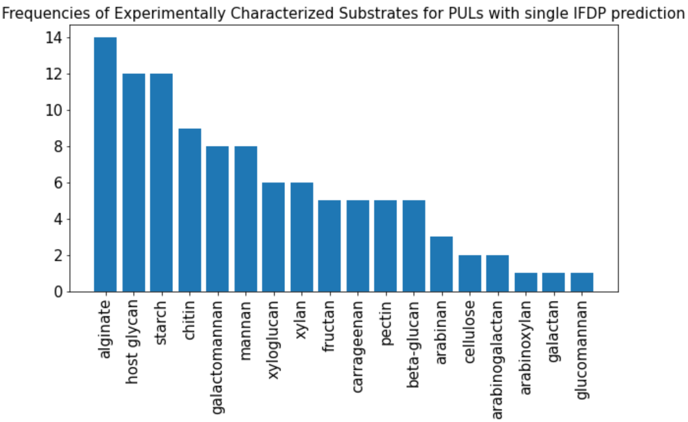
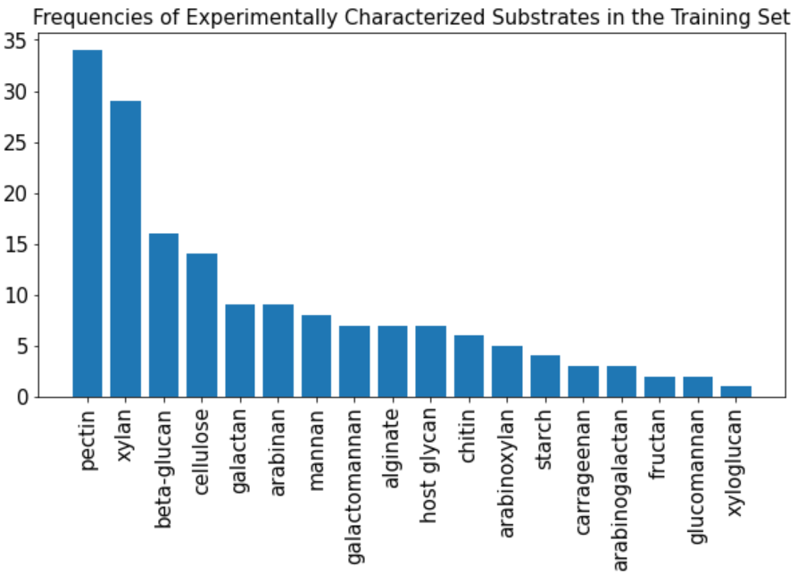
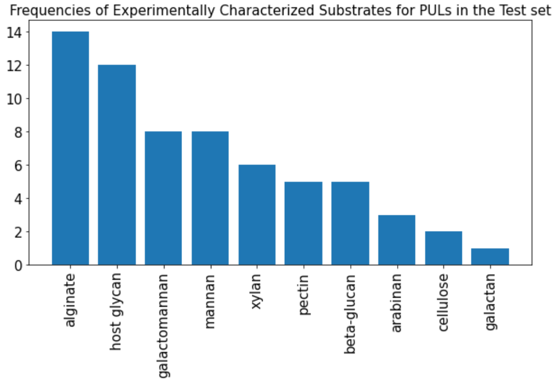
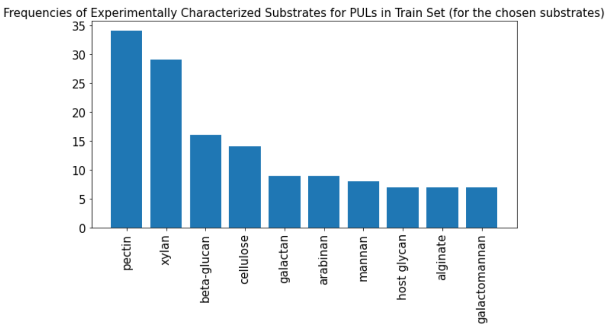
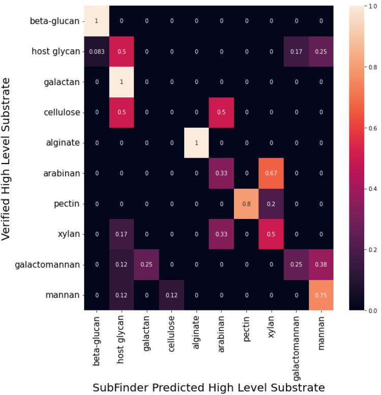
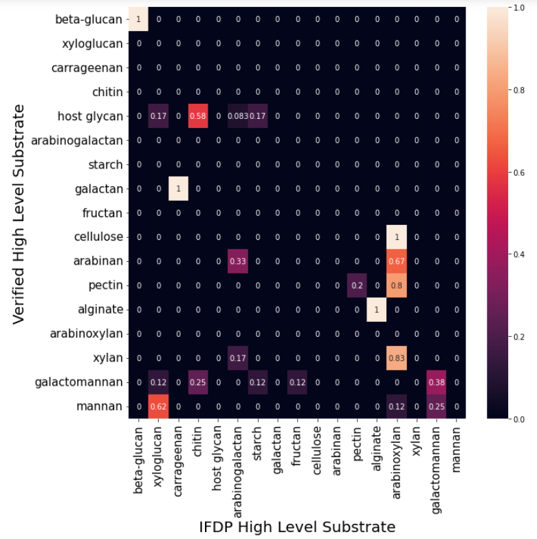

```{r setup, include=FALSE}
knitr::opts_chunk$set(echo = TRUE)
```

# Frequencies of Experimentally Verified Substrates for PULs having single substrate prediction from IFDP

The histogram below shows the frequencies of the experimentally verified substrates for those PULs which have single definitive substrate prediction from the IFDP method.



Since our goal is to compare the predictions of subFinder with IFDP method we will treat the above PULs as an independent test set and not train subFinder on these PULs.

# Frequencies of Experimentally Verified Substrates for PULs in the training set

The histogram below shows the frequencies of the experimentally verified substrates in the training set. The training set is composed of all PULs excluding the PULs in the test set as described in the previous section. We need to decide how many categories to retain for training. The goal should be to include as many substrate categories as possible so that we have a shot at predicting the majority of the PULs in the test set. However, we also need to consider the frequencies of the substrate categories in the training set as having substrate categories with too few samples will be detrimental to the machine learning model. 



I chose to retain the top 10 high level substrate categories in the histogram above. Together these 10 categories cover 64 out of the 105 PULs that we have in the testing set described above. The frequencies of these 10 categories in the test set is shown in the histogram below



The frequencies corresponding to the PULs of these 10 chosen categories in the training set that we will use to train subFinder is below: 



Notice that 6 out of the 10 substrates have less than 10 PULs in the training set. We need to keep this in mind for a "fair" comparison of the predictive performance of subFinder. 

# SubFinder Model Training

For the input features, I use the 50 dimensional Word2Vec Skip-Gram representation and the base model is a one vs all Balanced Random Forest Classifier. 

The accuracy of subFinder on the test set is $64.06\%$. The plot below shows the confusion matrix for the test set from the subFinder predictions. 



# IFDP predictions

The accuracy of IFDP on the test set is $35.93\%$. The plot below shows the confusion matrix for the test set from IFDP predictions. 


