```{r setup, include=FALSE}
knitr::opts_chunk$set(echo = TRUE)
```

# Data

There are two types of dataset that were used in this work. One is the supervised dataset which has the CGC sequences and the associated high level substrates. The second type of dataset are the unsupervised CGC sequences that do not have any associated high level substrates. The unsupervised CGC sequences come from five different domains of unsupervised ,cow rumen, human oral, marine, and UHGG. The supervised dataset has 411 CGC sequences belonging to 26 different high level substrates. The frequency distribution for the high level substrates is shown in Figure 1. Figure 2 shows the frequency of the Genera corresponding to the CGC sequences in the supervised dataset. 

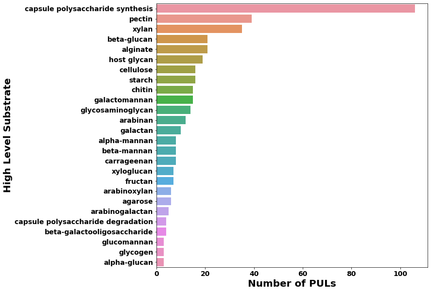

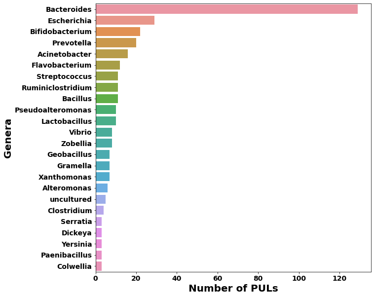

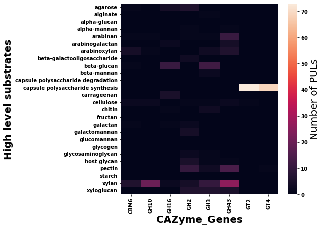

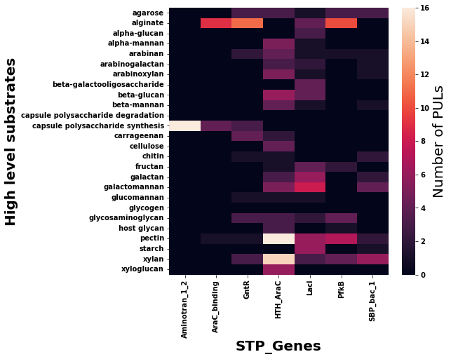

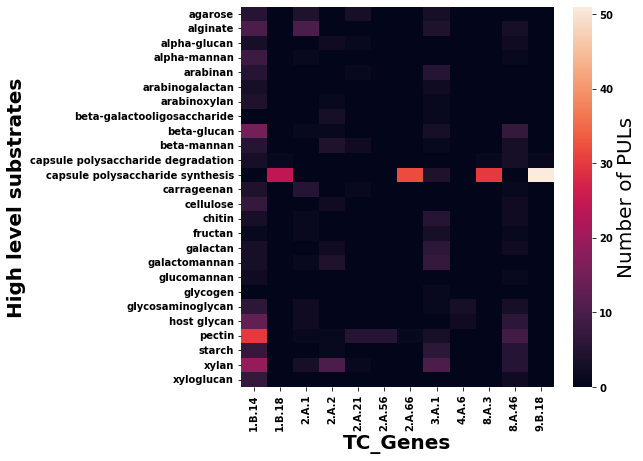

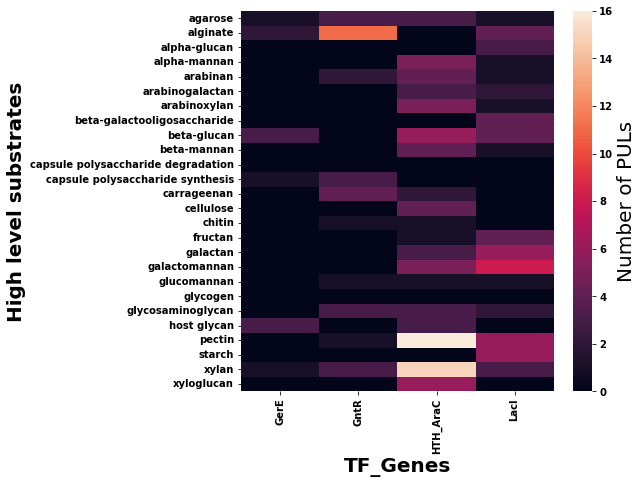

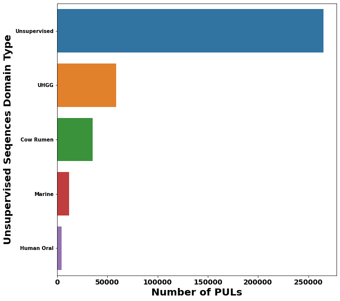

# Methods

## Feature Engineering

To create features from the CGC sequences we need a mathematical representation of the sequence in the form of a vector. There are several methods for converting a sequence of genes in the CGC sequence to a vectored representation. The most commonly used method is known as Bag of Words in which we first calculate the vocabulary of genes which is the set of unique genes from the supervised CGC sequences. Then each CGC sequence can be converted to a numerical vector of the same size as the size of the gene vocabulary where each element of the vector represents a specific gene from the vocabulary. Then we essentially count how many times each gene from the vocabulary appears in the CGC sequence and populate the corresponding element in the vector with this count. The one downside of this method is that it ignores the sequential order of appearance of the genes in the CGC sequence. Embedding methods such as Word2Vec, Doc2Vec, FastText are methods from the field of Natural Language Processing (NLP) that can convert a sequence of genes in the CGC sequence to a numerical feature vector. All of these methods take into account the relative positions of the genes in the CGC sequence to create the feature vector. Word2Vec and FastText methods create numeric feature vectors for each gene encountered in the vocabulary. Then a representation for the CGC sequence can be created by averaging out the respective feature vectors for the genes, in an element wise manner. Doc2Vec methods are able to create a numeric feature vector for the entire CGC sequence without the requirement of averaging out the vectors for individual genes as in the case of Word2Vec. 

The two approaches for training the Word2Vec models are Continuous bag of words (CBOW) and skip-gram (SG). The CBOW architecture of Word2Vec training learns vectored representations of the genes by using context genes in a specific window size to predict the center gene. On the other hand the SG architecture learns the vectored representations by predicting whether a context gene is relevant or irrelevant to a target gene. The relevancy of the context gene is determined by the window size parameter, that is the genes within the window size to a target gene are considered to be relevant else not. Just like Word2Vec, Doc2Vec also has two different training methods. The two methods are known as Distributed Memory (DM) and Distributed Bag of Words (DBOW). The DM method is similar to the CBOW architecture of the Word2Vec model except now the DM method also learns a representation for the CGC sequence. The DBOW method is similar to the SG architecture of the Word2Vec model where the document vectors are learned by training a model to predict randomly sampled genes from the CGC sequence. The DBOW model is lightweight as compared to the DM model because it only learns the CGC sequence vectors whereas the DM model learns the gene vectors jointly with the document vectors leading to a lot of trainable parameters. Both the CBOW and SG architectures in the Word2Vec model take into account the local sequence level information. In the case of Doc2Vec the DM model takes into account the sequence level information whereas the DBOW model does not take into account the sequence level information. However, as discussed earlier the DBOW model is very lightweight providing an excellent alternative to the more complex DM model in generating the sequence level feature vectors. In addition, we also tested the FastText model to create gene level embeddings just like Word2Vec. FastText uses character level n grams of the genes in addition to the usual genes in the learning process. This means that FastText model can generate reasonable embeddings even when the gene has not been observed in the training vocabulary by simply averaging out the character level embeddings of the gene. 

## Machine Learning Model - Balanced Random Forest Classifier

We used a slightly modified version of the standard Random Forest (RF) model called a Balanced Random Forest (BRF) as our baseline architecture. In this prediction problem, an even distribution of accuracies across all the high level substrate classes is preferred to a high overall accuracy. Balanced Random Forest modifies upon the RF by balancing the number of samples for each high level substrate category for each individual bootstrapped sample of the data during the training process. By doing so, it eliminates the risk for the model to be biased towards the frequently occurring substrate classes. Another benefit of the tree based ensemble models is that they can give feature importance values for the genes which can then be used for visualization purposes. Instead of training a multiclass BRF we train a one vs all version of the BRF where a binary classification model is trained for each high level substrate category present in the training set. Using a one vs all version allows us to easily compute (across all high level substrate categories) for each test sample the p values for the null hypothesis that the sample has a random chance of belonging to the specific high level substrate category. These p-value calculations would not be easy to compute with a multiclass model unless we use an ANOVA approach as the multiclass model returns for each sample a probability distribution across all the high level substrate categories. We denote these BRF models by the name of the feature engineering method that was used. They are named  `countvectorizer` which represents the BOW technique, `doc2vec_dbow`, `doc2vec_dm` represent the Doc2Vec variants with DBOW and DM techniques respectively, `word2vec_sg`, `word2vec_cbow` represent the Word2Vec variants with SG and CBOW techniques respectively, and `fasttext_sg`, `fasttext_cbow` represent the Doc2Vec variants with SG and CBOW techniques respectively. 

## Model Evaluation

We use a nested $10 \times 5$ cross validation scheme for hyper-parameter tuning. The benefit of this nested approach over the standard cross validation is that we can now do hyperparameter tuning and evaluates the generalization performance at the same time. We use the balanced accuracy metric to evaluate the performance of the machine learning models. Balanced Accuracy computes the average of the classwise accuracies in a multiclass classification model. In the inner loop of the nested cross validation scheme we evaluate different hyperparameter combinations and choose the one which has the lowest five fold averaged (average) accuracy and in the outer fold we evaluate the generalization performance of this hyperparameter combination using a ten fold cross validation. By doing this, we would get a more conservative estimate of the actual generalization error than the standard k-fold cross validation scheme. This is because in the case of the standard k fold cross validation we pick the hyperparameter combination which has the highest (average) balanced accuracy where the average is taken across the k cross validation folds. The estimate of the generalization error is thus biased because it was not estimated on an untouched test set but a validation set which was used during the hyperparameter tuning process. 

## P value Calculations

Since we use a nested $10 \times 5$ cross validation evaluation scheme for each of the outer 10 folds we would get 10 different hyperparameter combinations that were chosen using the hyper-parameter tuning done in the inner loop. Once we have these ten different hyper-parameter combinations we retrain the BRF models with these values of the hyper-parameter on all of the supervised CGC sequences. Then for each test sample and we can get ten different binary predictions of whether or not the sample belongs to the each of the high level substrate. Then using a binomial test we can calculate the p value corresponding to the alternative hypothesis that the test sample has a greater than random chance of belonging to each of the high level substrate categories.    

## Deep Learning Models

In addition to the BRF classification model we also tested out three different neural network architectures for predicting the high level substrates for the CGC sequences. The main advantage of these neural network architectures is that unlike the BRF model these models can assign an importance score between 0 and 1 to each gene in the CGC sequence depending upon how influential they are for the prediction of the model. A score closer to 1 means the gene was highly influential for the prediction and a score closer to 0 mean it was not influential. By tracking these influence scores across the training CGC sequences and then aggregating them across the various high level substrate categories we can gain an insight as to specific genes are characteristic for each high level substrate category. Both of these neural network architectures use the gene embeddings learned by either the Word2Vec or the FastText embedding model to represent the CGC sequence. However, unlike the element wise averaging done in the feature engineering for the BRF models here the process of averaging can be learned by the neural network architecture. The first architecture uses an attention layer in a standard feed forward neural network architecture which can learn the best averaging weights to combine the individual gene vectors of the CGC sequence. We denote this archiecture with the name `just_attention`. The benefit of this architecture is that now instead of assigning equal weights to each gene vector the model can itself determine the best way to average the gene vectors. Once the averaged representation of the vector has been computed the architecture passes that representation to the final prediction layer which has as many nodes as the number of high level substrate categories. The second architecture uses a Long Short Term Memory (LSTM) layer processes the sequence of gene vectors sequentially to come up with a representation for the CGC sequence. Ideally, the LSTM output corresponding to the last time step is sent to the final prediction layer but that model wouldn't have any analogs of the gene importance scores that we had in the first neural network architecture that only uses the attention layer. Therefore, we use the attention layer to learn the best way of combining the LSTM outputs from each time step to develop the representation of the CGC sequence. Once this representation has been constructed it is then passed to a prediction layer similar to the first architecture. We denote this second architecture with the name `lstm_with_attention`.


# Experimental Results

## Determining the optimum number of substrate categories to use in the classification model

Figure 1 shows that many of the 26 high level substrate categories from the supervised CGC sequences have only a handful of samples. This would make it impossible to create a multiclass classification model that can handle all 26 substrates. Therefore as a first step, we form an idea of how many maximum high level substrate categories can be handled by the classification model without foregoing the quality of performance of the model. Figure 8 and 9 show the trend in averaged ten fold cross validation accuracy and classwise accuracy for different number of high level substrates used in the classification model. It can also be seen that all of the models except `doc2vec_dm` perform better in general than the BRF model that uses the BOW technique. All the nine models except for the  `countvectorizer` and `doc2vec_dbow` take into account the relative ordering of the genes in the CGC sequence for the feature creation process. Therefore, it is clear that models that take into account the sequential ordering of the genes in the CGC sequence fair better in comparison to the BOW approach which ignores the sequential order. The bad performance of the `doc2vec_dm` model which does take the sequential order into account can be explained by the fact that it tries to learn vectors jointly for both the CGC sequences as well as the unique genes in the unsupervised dataset. This amounts to a task of training too many learnable parameters and the size of unsupervised samples is probably not enough for this joint training of sequence as well as gene vectors. We also see that `doc2vec_dbow` which does not take the sequential order of the genes into account is quite good. This is due to the fact that unlike the models that use the Word2Vec gene vectors this step does not require any averaging step to create the sequence vectors nor does it train the gene vectors like `doc2vec_dm`. Therefore `doc2vec_dbow` provides a simpler alternative to getting the sequence vectors than the Word2Vec models and it also has less learnable parameters thereby explaining why it has a good performance on a moderately sized unsupervised set of CGC sequences. 

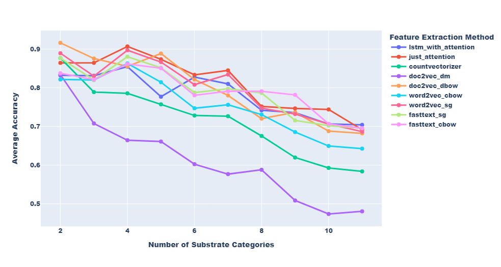

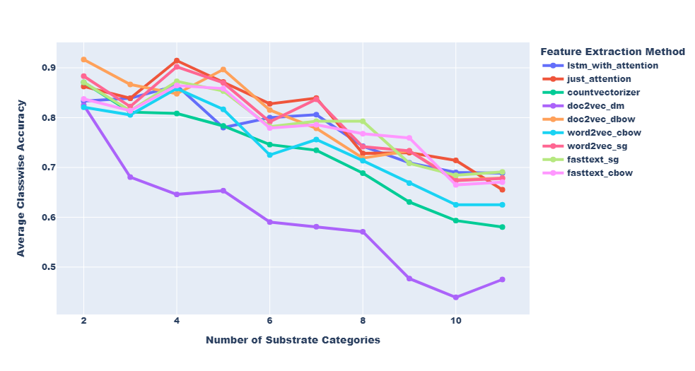

Figure 10 shows the averaged ten fold cross validation accuracy and classwise accuracy corresponding to the best model in each of the 10 cross validation folds. Here best is defined as the model that has the highest averaged ten fold cross validation accuracy. From this plot we see a general trend that as the number of high level substrate categories increase the performance of the classification model becomes worse. A reasonable value for the number of high level substrate categories for which the both the averaged ten fold cross validation accuracy and average classwise accuracy is greater than $80\%$ is seven.  

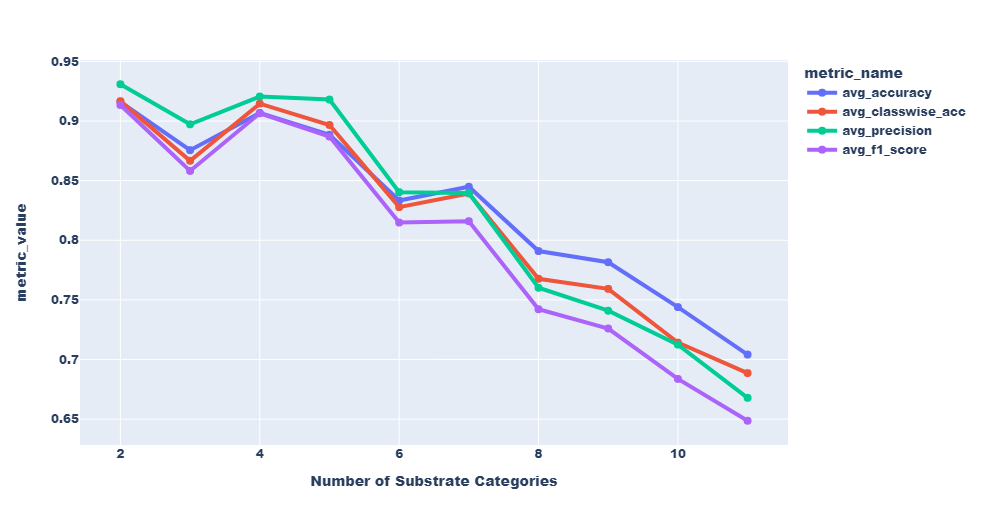

We can also compare which type of models are usually the best performing models by keeping a track of the winning models in each fold. Figure 11 shows that in four out of the ten folds the `just_attention` neural network model performed the best, followed by the `doc2vec_dbow` model which was best ub 3 of the folds. This shows that the neural network architecture of `just_attention` would be a great choice to use for the prediction model as not only does it have a good predictive performance but also by it's construction has model interpretability baked in as it can also provide the signature genes for the prediction. 

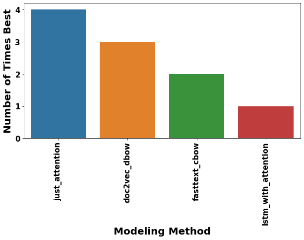

## A note for the practical application of the subFinder tool

When the prediction models created for subFinder will be used for real world prediction of high level substrate categories of unsupervised CGCs it is not necessary that the true high level substrate categories would be the same as our training set. Therefore, we explored a situation in which we can have a pseudo catch all high level substrate category called "Others" in addition to the top k most frequent high level substrate categories for the classification model. To explain what this "Others" category includes, assume we want to create a classification model that can predict if a new test sample belongs to one of the top seven high level substrate categories. The "Others" category then comprises of all the other nineteen high level substrates (total unique high level substrates is 26) that are there in the training set but different from the seven substrates that we want to predict using the classification model. The "Others" category will come in handy because of the known fact that it is not necessary for a new test sample to belong to only the seven high level substrate categories as it can belong to any of the 26 known high level substrate categories plus any other undiscovered high level substrate categories that are not there in the training set. Therefore, if the prediction models from subFinder predict one of the seven high level substrate categories with certainty we can provide that prediction to the user. However, if the subFinder model predicts the category of "Others" then we tell the user that the test sample can belong to any high level substrate categories except the seven high level substrate categories that we had chosen for the classification model. However, this "Others" category is not a naturally occurring category and has been artificially engineered by lumping sequences from various high level substrate categories making it a very heterogeneous category. It is well known that the presence of very heterogeneous categories can confuse a classification model and degrade its performance. Therefore, it would be interesting to compare the performance of the prediction models with and without the "Others" category for different values of high level substrate categories. Figure 12 shows the performance of the `doc2vec_dbow` model with and without the "Others" category for a varying number of high level substrate categories. It can be seen that for the model which includes the "Others" category the performance is considerably lower as compared to that of the model that does not include an "Others" category. Therefore even though the inclusion of the "Others" category would make the prediction models from subFinder more useful in the real world the plot in Figure 11 shows that the inclusion of such a heterogeneous category is actually detrimental for the model performance. Therefore, we need to find an alternative way of handling test sequences which are very different from the training sequences without the use of an "Others" category.  

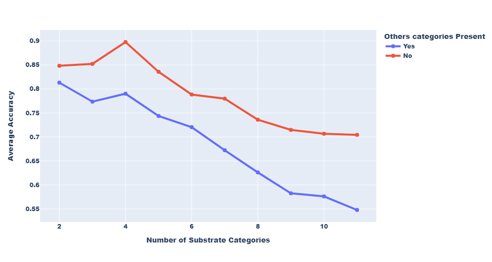


## Use of Deep Learning models to find signature genes

In this section basically show some results of signature gene finding. 


# Evaluating the quality of predictions from subFinder

In this section basically check the overlap of predictions for the unsupervised domains with Jinfang's predictions. Also check the overlap between signature genes from the deep learning models to Xinpeng's methods. 


